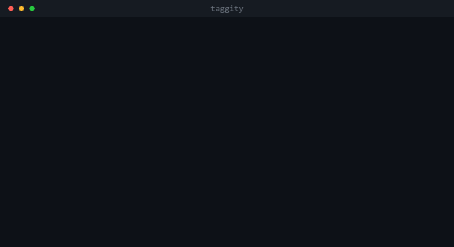

<p align="center">
  
</p>

<p align="center">Finds the versions an advisory says are safe and the code says are not.</p>

<p align="center">
  <a href="https://github.com/nickelsec/taggity/actions/workflows/ci.yml"></a>
  <a href="https://github.com/nickelsec/taggity/releases/latest"></a>
  <a href="https://github.com/nickelsec/taggity/blob/main/LICENSE"></a>
  <a href="https://pkg.go.dev/github.com/nickelsec/taggity"></a>
</p>

<p align="center">
  
</p>

<sub><i>The verdicts, commit hashes, release counts and drafted spec above are
transcribed from real runs against
<a href="https://github.com/qutebrowser/qutebrowser">qutebrowser</a> at the tags
shown; the spec is what the model returned. The frames are rendered rather than
screen-captured, so the pacing is set for reading, the commands ran separately
rather than in one session, the spec path is shortened, and the audit output is
trimmed of a commit-range claim the advisory also carries. The opening
<code>configure</code> screen is the command's own prompt text rather than a
transcript. The commands below reproduce the rest.</i></sub>

Advisories get version ranges wrong. A fix lands on 2.x and never on 1.x, or a
range is copied from a release note that was already wrong, and a scanner reading
that advisory stays quiet about a release that is still vulnerable.

taggity checks the claim against the source, one released version at a time.

Describe the bug in your own words and it writes the spec:

```sh
taggity draft --repo github.com/qutebrowser/qutebrowser \
  "a crafted qutebrowserurl: link reaches main() and can run commands
   like :spawn. The fix adds _validate_untrusted_args" > spec.yaml
```

```yaml
signal:
  code:
    file: qutebrowser/qutebrowser.py
    symbol: main
    rule:
      calls: _validate_untrusted_args
      indicates: fixed
```

`indicates: fixed` is there because the description said the fix *adds* a call.
The rule matches the patch rather than the bug, and taggity reads every verdict
accordingly — it is the field to check first in a drafted spec.

Then ask about any released version:

```sh
taggity check qutebrowser@1.14.1 --spec spec.yaml
```

```
qutebrowser@1.14.1
  looking for  calls: _validate_untrusted_args (indicates: fixed) in main

  found        no              main does not call _validate_untrusted_args

  → VULNERABLE
  read qutebrowser/qutebrowser.py at v1.14.1 (06cc853ef7c7)
```

PYSEC-2021-382 claims `< 1.8.0` and `>= 2.0.0, < 2.4.0`. It says nothing about
1.14.1, so a scanner reading it stays quiet — and the guard is not in that
release.

The verdict comes with the tag, the commit and the file it was read from, so
anyone can check the answer by hand. Verdicts are `VULNERABLE`,
`NOT_VULNERABLE` or `UNKNOWN`, and the third one is used often: when the symbol
moved or the file was unreadable, taggity says so instead of reporting the
version clean.

**Read the drafted spec before you trust a verdict from it.** A model writes a
plausible spec easily and a discriminating one less often, and the two look
identical on the page. The cheap way to tell: run it against a version before
the fix and one after. If both say the same thing, the rule matches code that
never changed and the spec proves nothing.

Once you can ask that about one version, `taggity audit` asks it at the edges of
an advisory's whole claimed range. That work is otherwise done by hand:
`github/advisory-database` carries 99 merged pull requests mentioning backports,
most of them corrections someone worked out one release at a time.

## Install

```sh
go install github.com/nickelsec/taggity/cmd/taggity@latest
```

Binaries for Linux, macOS and Windows are on the
[releases page](https://github.com/nickelsec/taggity/releases), with checksums
and an SBOM. Pure Go, no cgo, so nothing needs a C compiler.

Drafting needs a model. Nothing else does:

```sh
taggity configure
```

```
Which model should taggity draft with?
  1) Anthropic
  2) OpenRouter (many models behind one key)
```

The answer goes in a file written owner-only, which taggity refuses to read if
that changes. `ANTHROPIC_API_KEY` or `OPENROUTER_API_KEY` in the environment
always wins over the stored one, so CI needs no file and a single run can
override it.

`check`, `audit` and `export` never read a key unless you pass `--llm`.

## How it works

You write a spec describing the vulnerable construct:

```yaml
package:
  ecosystem: PyPI
  name: examplepkg
repo: https://github.com/example/examplepkg
advisory: GHSA-xxxx-yyyy-zzzz

signal:
  code:
    file: src/parser.py
    symbol: Alpha.parse_untrusted
    rule:
      calls: eval
```

A rule asks one structural question. `calls` looks for a call in the symbol's
own scope. `defaults` looks at parameter defaults, which is what you need when
a fix changed a signature rather than a call body:

```yaml
    rule:
      defaults:
        Loader: Loader
```

That one is the PyYAML case. `load()` constructs a `Loader` in every released
version, so asking about the call cannot find the boundary; asking about the
default puts it at 5.1, where the advisory says it is.

Then run it against a version:

```sh
taggity check redis@4.5.3 --spec spec.yaml
```

### When the code moves

Symbols get renamed and files get split, so a spec naming one path stops
matching for reasons that have nothing to do with the vulnerability. A package
that grew a `client/` package out of a single module can leave the same function
in three different files across one version range.

`code_any` takes several locations and the version counts as affected if any of
them matches:

```yaml
signal:
  code_any:
    - file: src/examplepkg/client/utils.py
      symbol: build_request
      rule: { calls: requests.get }
    - file: src/examplepkg/client/base.py
      symbol: Client._build_request
      rule: { calls: requests.get }
    - file: src/examplepkg/client.py
      symbol: Client._build_request
      rule: { calls: requests.get }
```

Output names the location that answered, and marks it in the breakdown:

```
  found        yes             Client._build_request calls requests.get

     UNKNOWN         src/examplepkg/client/utils.py  not present at v1.4.0
     UNKNOWN         src/examplepkg/client/base.py   not present at v1.4.0
   * yes             src/examplepkg/client.py        Client._build_request calls requests.get
```

If no location matches and one of them could not be read, the result is
`UNKNOWN`, not `NOT_VULNERABLE`. A location that was never examined is not a
location found clean.

When the symbol itself was renamed rather than moved, pin the old name to the
versions that carried it. A method promoted to a module function is the common
case:

```yaml
      symbol: build_request
      aliases:
        - symbol: Client._build_request
          versions:
            until: "2.0.0"
          source: human
```

The spec's own symbol is tried first, so an alias only answers where the real
name found nothing and adding one cannot change a version that already had an
answer. A verdict reached through an alias says so:

```
  * VULNERABLE  src/examplepkg/client.py  Client._build_request calls requests.get
                (alias for build_request)
```

An alias is a human claim that two names are the same construct, so the output
names the symbol that was actually read and leaves that claim visible.

### When you do not know where it went

Finding the moved file is the expensive part: it means reading source at that
tag by hand. `--llm` does that reading:

```sh
taggity audit --spec spec.yaml --advisory adv.json --llm
```

```
  COULD NOT CHECK
    1.10.4           the file is there, that function is not
      the module was split in 2.0 and this handler moved
      taggity re-checked pycsw/ogc/csw/csw2.py and found: VULNERABLE
```

**The model narrows the search; the engine still decides.** It proposes where
else to look, that proposal becomes an ordinary spec location, and the parser
re-checks and produces the verdict. Nothing a model says becomes a verdict,
because "the file is somewhere else" is a search failure rather than evidence
about what is in the file: the code may be there, the version may predate the
feature, or it may have moved and been fixed.

So the verdict beside a resolved gap is reproducible. Run the same spec tomorrow
with no model and you get the same answer, because what the model contributed
was a path.

Without `--llm` nothing changes and no key is read.

## Auditing an advisory's range

A range is a claim about its edges, so `audit` probes the edges:

```sh
taggity audit --spec testdata/corpus/GHSA-8fww-64cx-x8p5.yaml \
  --advisory testdata/corpus/GHSA-8fww-64cx-x8p5.json
```

```
GHSA-8fww-64cx-x8p5  redis
  claims  >= 4.5.0, < 4.5.4
  claims  >= 4.2.0, < 4.4.4
  looking for  calls: asyncio.shield (indicates: fixed) in Redis.execute_command
               this matches the FIX, so finding it means the version is patched
  checked      11 of 157 releases

  THE ADVISORY SAYS SAFE, THE CODE SAYS VULNERABLE
    5.3.1-8.1.0      the advisory never mentions this release line

  COULD NOT CHECK
    2.10.6-4.1.4     the file does not exist in this release

  1 to look at · 4 agree with the advisory · 1 could not be checked
```

That is 11 checks against redis-py's 157 tags instead of 157. `--verbose` adds
the machine-readable rule and reason codes behind each line.

A disagreement is something to go read, not a correction to file. The one above
was investigated by hand and turned out to be fine: the guard was deliberately
removed a release after the fix and replaced with a different mechanism.
`taggity export` keeps unreviewed disagreements out of its OSV output for that
reason.

Some of them hold up. PYSEC-2021-382 splits qutebrowser's CVE-2021-41146 into
`< 1.8.0` and `>= 2.0.0, < 2.4.0`, which leaves 1.8.0 through 1.14.1 implied
safe. The guard exists in no 1.x release, the advisory's own text says the fix
landed in 2.4.0, and the GHSA record for the same CVE uses one correct range of
`>= 1.7.0, < 2.4.0`. Eleven minor releases marked safe that are not.

`taggity init` will scaffold a spec if you would rather not write the YAML by
hand.

## Three valued verdicts

Verdicts are `VULNERABLE`, `NOT_VULNERABLE`, or `UNKNOWN`.

`UNKNOWN` is an answer. Going backwards through history a symbol gets renamed,
a file moves, code gets refactored, and the construct stops matching for
reasons that have nothing to do with the vulnerability. A tool that reports
"not vulnerable" there is confidently wrong in the direction that gets someone
compromised, so taggity says it could not tell and gives a reason code.

Wrongly flagging a version is recoverable; a maintainer disputes it and the
range narrows. Wrongly clearing one means a scanner stays quiet. Exactly one
code path in the repository can conclude `NOT_VULNERABLE`, and
`internal/taggity/invariant_test.go` walks the AST to keep it that way.

Matching runs on a real parser
([gotreesitter](https://github.com/odvcencio/gotreesitter)), so `eval(` in a
comment, a docstring or a nested function is not a call. An early prototype
used substring matching and was wrong on three of six adversarial cases while
looking entirely correct.

## What it does not do

- PyPI only. `package.ecosystem` is recorded and echoed into exported OSV, but
  nothing dispatches on it. There is one code path and it assumes Python.
- Two rule kinds. `calls` covers `eval`, `exec`, `pickle.loads`, `os.system`
  and similar sinks. `defaults` covers a changed default argument, which is how
  PyYAML's `yaml.load` was fixed. Vulnerabilities of any other shape, such as
  changed callee behaviour, are `UNKNOWN`.
- Rules ask whether a construct is present, which is not always the same
  question as whether the bug is. A missing input check is a good example: the
  sink is there before and after the fix, and only a guard around it changes.
  A rule naming the sink will keep reporting `VULNERABLE` after the fix lands.
  Write the rule against something the fix actually adds or removes, and if
  nothing structural changes, the spec cannot express that vulnerability.
- `draft` makes specs faster to write, not more expressive. It writes in the
  same two rule kinds, including specs that match a construct's neighbourhood
  rather than the bug, which is the failure directly above. Filtering the PyPI
  advisory database for multi-range advisories leaves 3,294, and 1,108 of them
  name a CWE this vocabulary cannot ask about at all.
- A drafted spec covers what the description mentions. If the same construct
  also lives in a file you did not name, the draft will not know: pycsw's fix
  touches `server.py` while the 2.x line kept a copy in `ogc/csw/csw2.py`.
  `--llm` is what finds the second one, after a check comes back `UNKNOWN`.
- Needs a git repository. No repo, no answer.
- Assumes the tag is what was published. Uploads from a dirty tree and
  untagged hotfixes are invisible.
- Does not resolve aliased imports. `from pickle import loads; loads(x)` will
  not match `calls: pickle.loads`.
- Aliases cover a renamed symbol, not a reimplemented one. Pinning the old name
  works when a fix renamed a function; it does nothing when the protection moved
  to a different module with a different decomposition, which is the more common
  shape and still reads as absence.
- No execution and no reachability analysis. Code being present is not the same
  as it being exploitable.
- `check` exits 0 even when the verdict is `VULNERABLE`. The exit status says
  whether the run worked, not what it found, so that a loop over versions is
  usable. Read the verdict on stdout, or pass `--quiet` to get it alone.

Most fixes add a guard rather than removing a dangerous call, so most specs set
`indicates: fixed` and their verdicts read inverted. That is the weaker
direction: a guard that disappears may have been reimplemented rather than
removed, which happened twice in the corpus.

Expect to hit it. Filtering the PyPI advisory database for multi-range
advisories whose fix deletes a dangerous call leaves seven candidates out of
1549 packages, and all seven are single-range. Of nine advisories audited here,
only two removed a call.

## Development

```sh
make test         # hermetic, no network, no API key
make test-corpus  # clones real repositories and checks against real advisories
make drill        # does draft write the spec a person wrote by hand? needs a key
make lint
make build
```

The corpus lives in `testdata/corpus/` alongside notes on what each case
established. `make test-corpus` is what reproduces the results above.

`make drill` is the only target that needs an API key, which is why it is not
in CI. It drafts specs for two corpus advisories and compares them with the
hand-written ones: trytond should match on file, symbol, rule and polarity,
and pycsw should hit the documented limit by covering one of its two locations.

`internal/llm` is the only package allowed to call a model, and `depguard`
fails the build if anything that can produce a verdict imports it. Deleting the
package leaves every other capability working, which is the point of the split.

## License

Apache-2.0. See [LICENSE](LICENSE).
